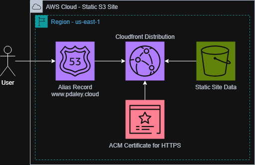

# Overview
This project is a secure, production-grade static website deployed on AWS and provisioned entirely using Terraform. By managing all cloud resources as infrastructure as code (IaC), the project ensures full reproducibility and maintainability with no manual configuration required.
# Architecture
The website is hosted on Amazon S3 and distributed globally through CloudFront, serving as a content delivery network (CDN) to optimize performance and minimize hosting costs. CloudFront is configured as the sole access point to the S3 origin, preventing direct public access to the bucket and enforcing a consistent security boundary across the infrastructure. DNS routing is managed through Amazon Route 53, ensuring reliable and secure domain resolution tied to the CloudFront distribution. An SSL/TLS certificate is provisioned through AWS Certificate Manager (ACM) to enforce HTTPS encryption across all traffic. 
# System Diagram 

